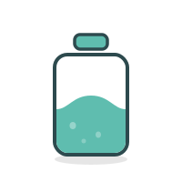

  

# DoseBar

A lightweight macOS menu bar app that reminds you to take your medications on time.

## Features

· **Menu bar app** that's always running, never in the way
· **Smart notifications** that escalate if you forget
· **One click "Mark as Taken"** directly from notifications
· **Snooze** reminders by 15 minutes
· **Daily reset** at midnight
· **Launch at login**
· **Completely private**, no data leaves your Mac

## How It Works

1. Add your medications with custom times and dosages
2. Get a gentle reminder at the scheduled time
3. If you don't take it within an hour, notifications escalate
4. Keeps nagging every 15 minutes until you mark the dose as taken

## Requirements

macOS 14.0 (Sonoma) or later.

## Privacy

DoseBar collects no data. No network connections, no analytics, no tracking. Everything stays on your Mac. See our [Privacy Policy](https://github.com/aximilies/DoseBar/blob/main/PRIVACY.md).

## Support

Have a question or found a bug? [Open an issue](https://github.com/aximilies/DoseBar/issues).
